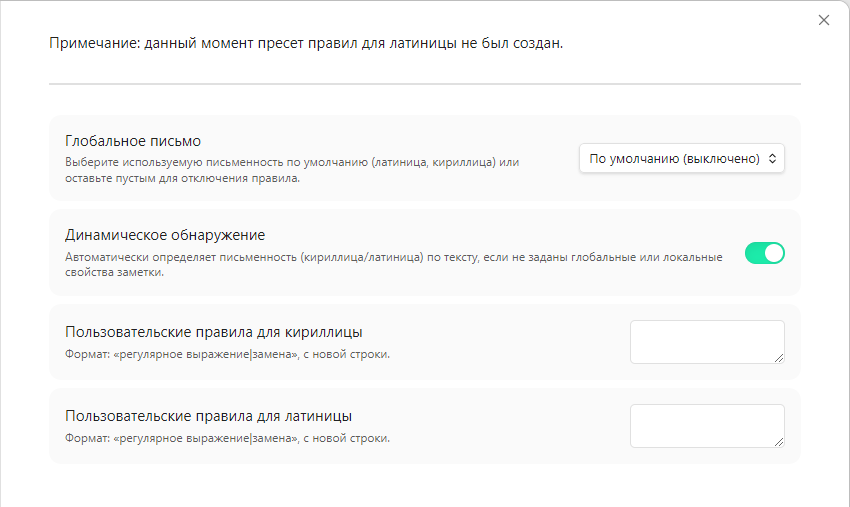

[English](#english) | [Русский](#русский)

---

# Preview Typography

A plugin that automatically applies typography rules to your notes in preview
mode.

The built-in typography rules are primarily focused on Cyrillic. However, the
plugin supports custom user-defined rules for both Cyrillic and Latin scripts.

The plugin does not modify the original note text.

### Settings

- **Global script:** Sets the default script (Latin/Cyrillic) globally for all
  notes. Default: "Disabled"
- **Dynamic detection:** Automatically detects the script in the text and
  applies the corresponding rules. This behavior is suppressed by the "Global
  script" setting or the "script" property of the note. Default: "Enabled"
- **Custom rules:** Define your own rules using the "expression|replacement"
  format (one rule per line). Custom rules take precedence over built-in ones.
  Common custom rules take precedence over built-in common rules, but not over
  script-specific rules.

### Note Properties

- **script:** Locally defines the script type for a specific note, overriding
  global settings.

### Built-in Replacement Rules

Rule priority (highest to lowest): custom script-specific → built-in
script-specific → custom common → built-in common.

#### Common (applied regardless of script)

| Expression                                                                   | Replacement       | Description                           |
| :--------------------------------------------------------------------------- | :---------------- | :------------------------------------ |
| Multiple spaces                                                              | Single space      | Remove redundant spaces               |
| Leading/Trailing space                                                       | Empty             | Trim line edges                       |
| --                                                                           | — (Em dash)       | Replace double hyphen with em dash    |
| - before number                                                              | − (Minus sign)    | Replace hyphen with math minus        |
| _n_-_n_ (Range) Includes roman numerals Both ASCII and U+2160–U+2188 | _n_–_n_ (En dash) | Proper interval formatting            |
| −*n*–_n_ (Negative range)                                                    | −*n*…_n_          | Use ellipsis in negative ranges       |
| ...                                                                          | … (Ellipsis)      | Replace three dots with single symbol |
| ' (Apostrophe)                                                               | '                 | Proper typographic apostrophe         |

#### Cyrillic

| Expression                    | Replacement              | Description                       |
| :---------------------------- | :----------------------- | :-------------------------------- |
| Space before % or ‰           | None                     | Remove space before percent signs |
| "text"                        | «text»                   | Standard typography quotes        |
| ""text""                      | «„text"»                 | Hierarchical quotes               |
| "text" "text" "text"          | «text „text" text»       | Nested quotes                     |
| Spaces inside quotes/brackets | None                     | Remove "hanging" spaces           |
| .»                            | ».                       | Move period outside quotes        |
| Currency with space           | Amount + NBSP + Currency | Bind currency symbol to number    |
| Paragraph starting with —     | — + NBSP                 | Bind em dash to first word        |
| Em dash in text               | NBSP + — + NBSP          | Proper em dash spacing            |
| Thousands grouping            | NBSP                     | Improve number readability        |
| Initials (I. I. Ivanov)       | Narrow space             | Compact initials formatting       |
| Particles (б, бы, же...)      | NBSP + particle          | Bind particles to previous word   |
| Prepositions                  | Word + NBSP              | Bind prepositions to next word    |
| Single letters                | Letter + NBSP            | Bind single letters (e.g., "Я")   |
| Last word of paragraph        | NBSP                     | Prevent orphan word               |

#### Latin (English)

| Expression            | Replacement        | Description                 |
| :-------------------- | :----------------- | :-------------------------- |
| "text"                | "text"             | Standard smart quotes       |
| ""text""              | "'text'"           | Hierarchical quotes         |
| "text" "text" "text"  | "text 'text' text" | Complex nested quotes       |
| Currency symbol+space | Currency+number    | Remove space after currency |
| fi / fl               | fi / fl              | Typographic ligatures       |

---

# Типографика предпросмотра

Плагин для применения правил типографики в режиме предпросмотра текста заметки.

Встроенные правила типографики в основном ориентированны на кириллицу (автор
проекта плохо разбирается в английской типографике). Однако имеется поддержка
пользовательских правил — как для кириллицы, так и для латиницы.

Плагин не изменяет исходный текст заметок. Возможно позже будет добавлена
команда для применения правил для исходного текста.

### Настройки

- **Глобальное письмо:** настраивает тип письменности (латиница/кириллица) на
  глобальном уровне для всех заметок. По умолчанию «выключено».
- **Динамическое обнаружение:** автоматически определяет тип письменности в
  тексте и применяет соответствующие правила. Подавляется настройкой «Глобальное
  письмо» или свойством «письмо» заметки. По умолчанию «включено».
- **Пользовательские правила:** можно задавать собственные правила, записывая их
  в формате «выражение|замена» (каждое правило с новой строки). Такие правила
  имеют приоритет над встроенными. Общие пользовательские правила имеют
  приоритет над встроенными общими, но не над правилами конкретной письменности.

### Свойства заметок

- **письмо:** (синоним — script) локально определяет тип письменности для
  заметки, имеет приоритет над глобальным.

### Встроенные правила замены

Приоритет правил (от высшего к низшему): пользовательские правила письменности →
встроенные правила письменности → пользовательские общие правила → встроенные
общие правила.

#### Общие (применяются вне зависимости от письменности)

| Выражение                                                     | Замена                  | Описание действия                                                       |
| :------------------------------------------------------------ | :---------------------- | :---------------------------------------------------------------------- |
| Несколько пробелов подряд                                     | Один пробел             | Удаление лишних пробелов                                                |
| Пробел в начале или конце строки                              | Пустота                 | Очистка краев строки                                                    |
| --                                                            | — (Длинное тире)        | Замена двойного дефиса на тире                                          |
| - перед числом                                                | − (Знак минус)          | Замена дефиса на математический минус                                   |
| Диапазон цифр (_n_-_n_) Включает римские цифры ASCII и U+2160–U+2188         | _n_–_n_ (Короткое тире) | Корректное оформление интервалов                                        |
| Диапазон с отрицательным числом и дефисом/тире (−*n*–_n_) | −*n*…_n_                | Замена дефисов/тире на многоточие в интервалах с отрицательными числами |
| ...                                                           | … (Многоточие)          | Замена трех точек на один символ                                        |
| Машинописный апостроф ( ' )                                   | '                       | Замена машинописного апострофа на корректный                            |

#### Кириллица

| Выражение                              | Замена                                      | Описание действия                           |
| :------------------------------------- | :------------------------------------------ | :------------------------------------------ |
| Пробел перед % или ‰                   | Удаление пробела                            | Правильная верстка знаков процентов         |
| "текст"                                | «текст»                                     | Замена машинописных кавычек на корректные   |
| ""текст""                              | «„текст"»                                   | Иерархические кавычки                       |
| "текст" "текст" "текст"                | «текст „текст" текст»                       | Сложная вложенность кавычек                 |
| Пробелы внутри кавычек и скобок        | Удаление пробелов                           | Устранение «висячих» пробелов внутри знаков |
| .»                                     | ».                                          | Вынос точки за кавычку                      |
| Валюта с пробелом                      | число + неразрывный пробел + валюта         | Привязка валюты к числу                     |
| Начало абзаца с тире                   | — + неразрывный пробел                      | Привязка тире к первому слову               |
| Тире с пробелами внутри текста         | неразрывный пробел + — + неразрывный пробел | Корректная верстка тире                     |
| Группировка тысяч в числах             | неразрывный пробел                          | Улучшение читаемости больших чисел          |
| Инициалы с фамилией (И. И. Иванов) | узкий пробел (И. И. Иванов)             | Компактная верстка инициалов                |
| Частицы (б, бы, же...)                 | неразрывный пробел + частица                | Привязка частиц к предыдущему слову         |
| Предлоги и сокращения                  | слово + неразрывный пробел                  | Привязка предлогов к следующему слову       |
| Одиночные буквы                        | буква + неразрывный пробел                  | Привязка одиночных букв (напр., "Я")        |
| Последнее слово абзаца                 | неразрывный пробел                          | Защита от переноса последнего слова         |

#### Латиница

| Выражение                | Замена             | Описание действия                         |
| :----------------------- | :----------------- | :---------------------------------------- |
| "text"                   | "text"             | Замена машинописных кавычек на корректные |
| ""text""                 | "'text'"           | Иерархические кавычки                     |
| "text" "text" "text"     | "text 'text' text" | Сложная вложенность кавычек               |
| Символ валюты + пробел   | Валюта + число     | Удаление пробела после символа валюты     |
| Вставка лигатур (fi, fl) | fi, fl               | Корректное оформление лигатур             |
